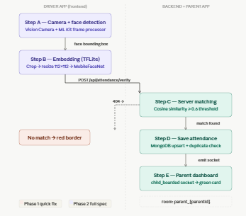

# VisageRoute
**Intelligent Bus Tracking & Management System**

A secure, 3-module React Native mobile application for student transportation management. Built with a "Secure by Design" approach using JWT authentication, role-based access control, real-time GPS tracking via Socket.io, and AI-powered facial recognition attendance.

---

## Modules

| Module | Users | Key Features |
|--------|-------|-------------|
| Admin  | Institute Staff | CRUD for students/drivers/buses, schedule upload, announcements |
| Driver | Bus Drivers | Live GPS sharing, face-scan attendance, route view |
| Parent | Student Parents | Real-time bus tracking (OSM), on-board status, notifications |

---

## Tech Stack

| Layer | Technology |
|-------|-----------|
| Mobile Frontend | React Native (Expo) |
| Backend | Node.js + Express |
| Database | MongoDB Atlas (M0 Free Tier) |
| Real-time GPS | Socket.io |
| Maps | react-native-maps + OpenStreetMap tiles |
| Face Detection | react-native-vision-camera + Google ML Kit |
| Face Recognition | TensorFlow Lite (MobileFaceNet — 128-d embeddings) |
| Push Notifications | Firebase Cloud Messaging (FCM) |
| Authentication | JWT (Role-Based: Admin / Driver / Parent) |
| Security | bcrypt, Zod validation, express-rate-limit, OWASP |

---

## Project Structure

```
VisageRoute/
├── frontend/                  # React Native (Expo)
│   ├── app/
│   │   ├── (auth)/            # Login, Splash
│   │   ├── admin/             # Admin module screens
│   │   ├── driver/            # Driver module screens
│   │   └── parent/            # Parent module screens
│   ├── components/            # Shared UI components
│   ├── hooks/                 # Custom hooks (useAuth, useLocation)
│   ├── services/              # API calls, Socket.io client
│   ├── theme/                 # Colors, typography (yellow/white theme)
│   └── utils/                 # Helpers, validators
│
├── backend/                   # Node.js + Express
│   ├── controllers/           # Route handlers
│   ├── middleware/             # Auth (JWT), rate-limit, validation
│   ├── models/                # Mongoose schemas
│   ├── routes/                # API route definitions
│   ├── services/              # FCM, Socket.io, face matching
│   ├── sockets/               # Socket.io event handlers
│   └── utils/                 # ETA calc, embedding matcher
│
├── .env.example               # Environment variable template
└── README.md
```

---

## Environment Variables

```env
# Backend (.env)
MONGODB_URI=your_mongodb_atlas_uri
JWT_SECRET=your_jwt_secret_min_32_chars
JWT_EXPIRES_IN=15m
JWT_REFRESH_SECRET=your_refresh_secret
FIREBASE_SERVER_KEY=your_fcm_server_key
PORT=5000

# Frontend (.env)
API_BASE_URL=http://your_backend_ip:5000
SOCKET_URL=http://your_backend_ip:5000
```

> ⚠️ Never commit `.env` files. Both are listed in `.gitignore`.

---

## Face Recognition Flow

```
Driver opens camera
       ↓
react-native-vision-camera captures frame
       ↓
Google ML Kit detects face → bounding box
       ↓
TFLite (MobileFaceNet) generates 128-d embedding on-device
       ↓
Embedding sent to Node.js backend via HTTPS POST
       ↓
Backend queries MongoDB: cosine similarity vs stored embeddings
(threshold ≥ 0.6 for match)
       ↓
Match found → log attendance + send FCM to parent
```

---

## Real-Time GPS Flow (Socket.io)

```
Driver swipes START on dashboard
       ↓
Device GPS activated → coordinates every 10 seconds
       ↓
Driver app emits: socket.emit('bus_location_update', { busID, lat, lng, speed })
       ↓
Server receives → attaches timestamp → broadcasts to parent room
       ↓
Parent app receives → updates OSM map marker smoothly
```

---

## Security Highlights

- **JWT:** 15-min expiry + refresh token rotation
- **Passwords:** bcrypt (saltRounds: 12)
- **Rate Limiting:** express-rate-limit on all endpoints (stricter on /login)
- **Input Validation:** Zod schemas on all API inputs
- **RBAC Middleware:** Role verified on every protected route
- **Face Data:** Only 128-d embeddings stored — no raw images
- **Keys:** All API keys in `.env` — never in client bundle
- **OWASP:** NoSQL injection prevention via Mongoose strict casting

---

## Getting Started

```bash
# Clone repo
git clone https://github.com/your-username/visageroute.git

# Backend setup
cd backend
npm install
cp .env.example .env        # fill in your keys
npm run dev

# Frontend setup
cd frontend
npm install
cp .env.example .env        # fill in API_BASE_URL
npx expo start
```

---

## Development Timeline

| Phase | Month | Focus |
|-------|-------|-------|
| Foundation | Month 1 | Auth, security baseline, UI setup |
| Core Modules | Month 2 | Admin CRUD, driver APIs, validation, rate limiting |
| Real-time & AI | Month 3 | GPS tracking, face recognition, FCM, security audit |

---

*Developed by Zainab Mustafvi — Session 2022–2026*

